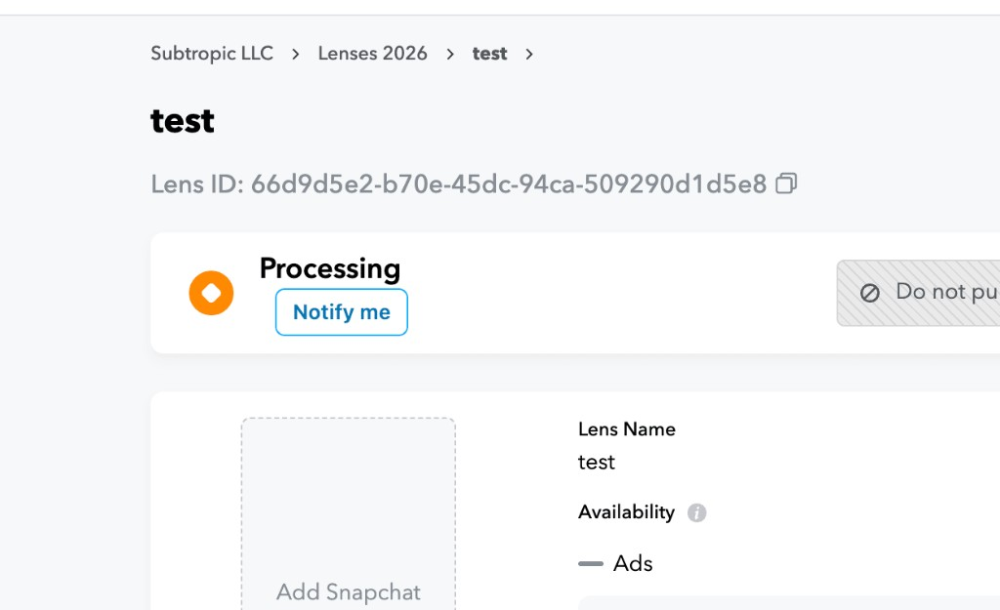
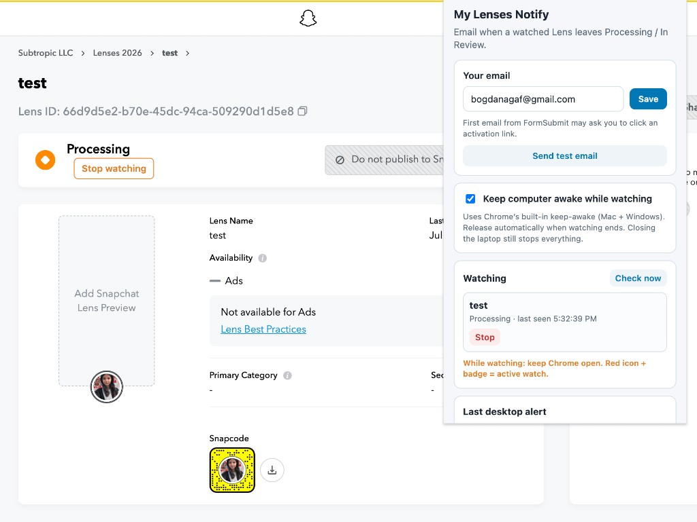

# My Lenses Notify

Chrome extension that emails you (and shows a small alert) when your Lens leaves **Processing / In Review**.

## Install (once)

1. Open Chrome → `chrome://extensions`
2. Turn on **Developer mode**
3. Click **Load unpacked** and select this folder
4. Pin the extension

## Setup (once)

1. Open the extension
2. Enter your email → **Save**
3. Click **Send test email**
4. If you get an **Activate Form** email from FormSubmit, open it once, then send another test

## How to use

1. Open your Lens in My Lenses while it is **Processing**
2. Click **Notify me** next to the status

3. The extension opens a **pinned background tab** and checks the status from time to time.
   **Do not close that tab** — it closes automatically when the status changes and you get the alert.
4. Keep **Chrome running** (minimized / in background is fine — you can work in other apps)

When watching is active, the page shows **Stop watching**, and the extension lists the Lens:

5. When the status changes, you get:
   - an email
   - a soft click
   - a small alert window
   - and the pinned watcher tab closes by itself

## Icon colors

- **Yellow** — nothing watching
- **Red** (+ badge) — watching
- **Green** (briefly) — just finished

## Important

- Do **not** quit Chrome while watching
- Do **not** close the pinned watcher tab (the extension needs it to check status)
- Do **not** put the laptop to sleep / close the lid — that pauses watching
- Leave **Keep computer awake while watching** enabled if you want Chrome to help prevent idle sleep (works even when another app is focused)
- After you click **Reload** on the extension in `chrome://extensions`, refresh any open My Lenses tabs (or just Reload the extension again — it re-injects). “Extension context invalidated” errors are leftover from the old script and can be cleared.
